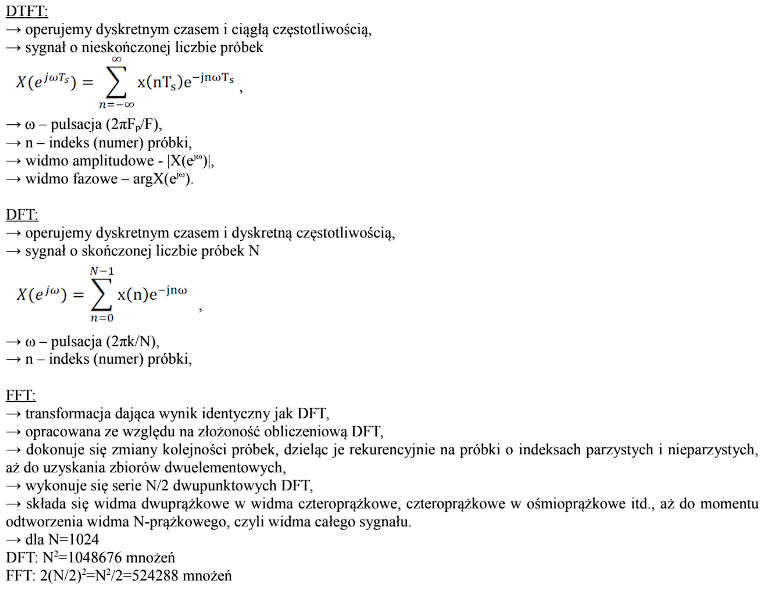
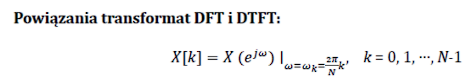
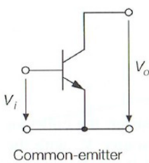

# **Pytania kierunkowe**
## 1. Widmo sygnału analogowego (podstawowo-pasmowego i pasmowego) a twierdzenie o próbkowaniu.
Widmo sygnału jest to reprezentacja sygnału w dziedzinie częstotliwości, wyznaczana najczęściej z transformacji Fouriera. Aby sygnał był użyteczny w technice cyfrowj musi zostać zdyskretyzowany, a więc konieczne jest jego spróbkowanie oraz kwantyzacja, a widmo wyznacza się wtedy z DFT (w praktyce FFT).

Próbkowanie jest procesem konwersji sygnału analogowego (o czasie ciągłym) do postaci próbek pobieranych w rónomiernych odstępach czasu (zwanych okresem próbkowania T).

Twierdzenie Nyquista o próbkowaniu sygnału mówi nam, że jeżeli sygnał analogowy xa(t) jest ograniczony pasmowo (ma ograniczoną pasmowo transformatę Fouriera) to sygnał może być bezbłędnie i jednoznacznie zrekonstruowany na podstawie ciągu równomiernie rozłożonych próbek:

 x[n]=xa(*n*TS), *n*∈I 

 jeżeli: 

 FS=1/TS≥2Fmax 

FS - częstotliwość próbkowania,

Fmax - częstotliwość górna sygnału,

Częstotliwość Nyquista - połowa FS

Z właściwości transformaty Fouriera wiadomo, że widmo sygnału dyskretnego jest okresowe (co fs się powtarza). A więc jeżeli się próbkuje sygnał z częstotliwocią niższą od częstotliwości Nyquista zajdzie zjawisko aliasingu i wynikowo widma zaczną na siebie zachodzić.

Sygnał analogowy podstawowo-pasmowy jest sygnałem ograniczonym pasmowo o widmie ulokowanym wokół częstotliwości zerowej. Widmo w funkcji częstotliwości:

A więc żeby spróbkować sygnał podstawowo-pasmowy wystarczy zastosować twierdzenie Nyquista o próbkowaniu sygnałów.

Sygnał pasmowy jest to sygnał o ograniczonym widmie ulokowanym wokół częstotliwości +f.
Widmo w funkcji częstotliwości:

Zastosowania twierdzenia Nyquista o próbkowaniu sygnałów dla tego sygnału jest nieefektywne. W przypadku takich sygnałów możliwe jest takie dobranie szybkości próbkowania mniejszej od szybkości Nyquista, które zapewnia zachowanie nie zniekształconego widma sygnału przesuniętego jedynie w dziedzinie częstotliwości i w niektórych przypadkach widmie odwróconym w częstotliwości. Wynika to z faktu, że podczas podpróbkowania zachodzi zjawisko aliasingu, czyli sygnały "podszywają się" pod sygnały o innych częstotliwościach. Takie próbkowanie sygnału nazywa się podpróbkowaniem.

Różnica względem twierdzenia o próbkowaniu Nyquista jest taka, że:

 FS>2B 

B - pasmo sygnału

Dodatkowo FS nie może być dowolne, występują dopuszczalne pasma próbkowania. W wyniku podpróbkowania w dopuszczalnych pasmach próbkowania uzyskuje się widmo odwrócone w częstotliwości bądź widmo bez odwrócenia. Jeśli do podpróbkowania zostanie wybrana częstotliwość spoza dopuszczalnego pasma to zajdzie zachodzeni się na siebie widm sygnału.

Jak dobrać FS nie znając wzorów, które wyznaczają dopuszczalne pasma próbkowania:
    Jeżeli pasmo B mieści się całkowitą ilość razy w częstotliwości fH (iloraz fH/B jest liczbą naturalną), to minimalną szybkością próbkowania przy której nie zajdą zniekształcenia jest fS=2B

Jeżeli jednak pasmo B nie mieści się całkowitą liczbę razy w fH (iloraz fH/B nie jest liczbą naturalną), to wartość B należy zwiększyć do takiej najbliższej wartości B', która mieści się całkowitą ilość razy w fH. Wtedy minimalną szybkością próbkowania, przy której nie zajdą zniekształcenia aliasowe to fS=2B'. W ten sposób "ogony" replik nie tylko nie nachodzą na siebie, ale istnieje również zapas równy 2(B'-B).

## 2. Widmo sygnału dyskretnego i transformacje (DTFT, DFT, FFT) służące do obliczania tego widma oraz powiązania tych transformat.
Sygnał dyskretny - sygnał, który powstał w wyniku dyskretyzacji (próbkowania) sygnału ciągłego (analogowego)
DTFT (Discrete Time Fourier Transform) - dyskretno-czasowe przekształcenie Fouriera
DFT (Discrete Fourier Transform) - dyskretne przekształcenie Fouriera
FFT (Fast Fourier Transform) - szybkie przekształcenie Fouriera

## 3. Twierdzenia Schannona i ich interpretacje.
## 4. Usługi w sieci telekomunikacyjnej - klasyfikacja, charakterystyki, jakość usług.
Usługa telekomunikacyjna - przesyłanie na odległość informacji (w postaci mowy, muzyki, znaków, pisma, rysunków, fotografii, obrazów, danych, itp.) za pomocą sygnałów elektrycznych, optycznych lub radiowych. Świadczona każdorazowo przez operatora (dzięki jego urządzeniom i organizacji) na rzecz użytkowników i na ich żądanie. Usługi telekomunikacyjne można podzielić na usługi podstawowe (ang. basic services), usługi dodatkowe (ang. supplementary services) i usługi dodane. Usługi podstawowe i dodatkowe są opisane w specyfikacji standardu, na którym oparta jest sieć.

Usługi podstawowe: 
- teleusługi (ang. teleservices) - usługi umożliwiające zestawienie pewnych, zdefiniowanych dla danego standardu sieci, połączeń (np. zwykłe połączenie telefoniczne, połączenie alarmowe, wysyłanie wiadomości SMS) i zapewniają w tym celu współpracę różnych elementów sieciowych i terminali końcowych.
- usługi przenoszenia (bearer services) - zapewniające transport informacji pomiędzy punktami dostępowymi sieci

Usługi dodatkowe - rozszerzają możliwości usług podstawowych. Przykładem może być możliwość ustawienia przekierowania na inny numer gdy abonent nie odpowiada, zestawienia telekonferencji lub ustawienie identyfikacji numeru dzwoniącego.

Usługi dodana - usługi nie objęte specyfikacją dla standardu, na którym oparta jest sieć. Mogą one kontrolować usługi objęte specyfikacją, bądź wykorzystywać je dla dostarczenia abonentowi dodatkowych treści i możliwości co poszerzy ofertę operatora na tle rybku. Usługi kontrolujące usługi podstawowe, oparte są zwykle o platformę sieci inteligentnych np. serwis prepaid, który kontroluje ilość środków na koncie abonenta i może w każdej chwili zakończyć połączenie lub transmisję danych. Przykładem usług, które wykorzystują usługi podstawowe dla zaoferowania informacji lub możliwości nie objętych specyfikacją sieci mogą być: umożliwienie abonentom wysyłania MMS, głosowania za pomocą SMS, nagrywania i odsłuchiwania poczty głosowej lub tzw. VoD (ang.Video on Demand).

Inne sposoby specyfikacji:
- ze względu na wymagane łącza:
    - usługi połączeniowe wymagające stworzenia kanału logicznego dla stałego połączenia na czas realizacji usługi
    - usługi bezpołączeniowe (nie wymagające stworzenia kanału)
- z punktu widzenia abonenta:
    - usługi interaktywne: konwersacyjne (dwukierunkowa wymiana informacji w czasie rzeczywistym: telefonia, wideotelefonia), przekazywanie wiadomości (dwukierunkowa wymiana informacji), wyszukiwanie/dostęp do informacji (przesyłanie do użytkownika, na jego żądanie, informacji wcześniej zgromadzonych)
    - usługi dystrybucyjne (rozsiewcze): jedokierunkowe rozprowadzanie informacji do wielu użytkowników (użytkownik nie ma wpływu na szybkość i czas przesyłania danych ani treści), usług z/bez możliwości indywidualnego sterowania prezentacją (telegazeta, telewizja programowa)

Jakość usług:
- GoS (Grade of Service) - poziom świadczonych usług - określa pewne parametry (związane z inżynierią ruchu), których wartości umożliwiają odpowiedź na pytanie o wystarczalności posiadanych zasobów (przy ustalonych założeniach, co do panujących warunków). Parametrami GoS przykładowo są: prawdopodobieństwo nieuzyskania usługi, prawdopodobieństwo strat zgłoszenia, czy prawdopodobieństwo zajętości wszystkich zasobów, które wynikają z faktu, że zdolność obsługi sieci/elementów sieci jest ograniczona i nie zawsze może sprostać istniejącemu zapotrzebowaniu ruchowemu.
- QoS (Quality of Service) - zbiór mechanizmów, które mają zapewnić dostarczenie przewidywalnego poziomu jakości usług sieciowych, poprzez zapewnienie określonych parametrów transmisji danych, w celu osiągnięcia satysfakcji użytkownika. Gwarantowana jakość usłgu jest to zestaw technologii zapewniających odpowiedni (przewidywalny) poziom usług w kontekście przepustowości, opóźnienia i zmienności opóźnienia (ang. jitter).

Przykładowe mechanizmy zapewniające jakość usług polegają na:
- kształtowaniu i ograniczaniu przepustowości
- zapewnianiu sprawiedliwego dostępu do zasobów
- nadawaniu odpowiednich priorytetów poszczególnym pakietom
- zarządzaniu opóźnieniami w przesyłaniu danych
- unikaniu przeciążeń

## 5. Narysuj schemat blokowy i omów działanie łącza radiowego.
Łącze radiowe - zestaw urządzeń służący do przesyłania i odbierania sygnału radiowego oraz środowisko propagacji, służy do nadawania i odbierania informacji za pośrednictwem fal radiowych, na wyjściu części odbiorczej nigdy nie pojawi się w 100% ta sama informacja, która została wprowadzona na wejście części nadawczej, działa poprawnie, gdy informacja jest odtwarzana z dostatecznie wymaganą dokładnością, określoną w systemach analogowych jako stosunek natężenia sygnału do natężenia szumu (S/N) na wyjściu odbiornika, a wsystemach cyfrowych poprzez Pb.

Nadajnik: Informacja I (np. ludzki głos) jest wprowadzana do przetwornika nadawczego PN i przetwarzana na sygnał elektryczny s(t) o małej częstotliwości i bardzo niskiej mocy. Wzmacniaczem małej częstotliwości nadaje sygnałowi s(t) poziom energetyczny pozwalający na przeniesienie go w pasmo wysokich częstotliwości i następnie po przejściu przez filtr dolnoprzepustowy wprowadza do przetwornika małuch częstotliwości na wysokie częstotliwości, gdzie powstaje sygnał radiowy r(t) o wysokiej częstotliwości. Następnie sygnał przechodzi przez filtr pasmowoprzepustowy.
Jego poziom energetyczny jest zbyt niski by mógł być bezpośrednio wypromieniowany do środowiska propagacji, więc wzmacniacz wysokiej częstotliwości nadaje mu odpowiednią moc PN i poprzez antenę nadawczą AN sygnał jest wysyłany w świat.

Odbiornik: Sygnał w postaci fali elektromagnetycznej jest odbierany ze środowiska propagacji przez antenę odbiorczą Ao, w wyniku czego powstaje sygnał radiowy r'(t) o wysokiej częstotliwości (nieco zmieniony w stosunku do oryginalnego sygnału r(t) przez zjawiska występujące w środowisku propagacji). Ze względu na odległość pomiędzy częścią odbiorczą a nadawczą łącza, sygnał r'(t) ma niską moc, tymczasem dla poprawnego działania modułu przenoszącego sygnał w pasmo małych częstotliwości moc ta musi być odpowiednio wysoka. Zapewnia to wzmacniacz wysokiej częstotliwości. Sygnał przechodzi przez filtr pasmowoprzepustowy następnie przechodzi przez przetwornik częstotliwości. Sygnał podstawowy s'(t) o małej częstotliwości i mocy, który następnie przechodzi przez filtr dolnoprzepustowy. Poziom energetyczny potrzebny do poprawnej pracy przetwornika odbiorczego Po uzyskuje się we wzmacniaczu małej częstotliwości. Na wyjściu ostatniego modułu pojawia się informacja I'.

Środowisko propagacji: Ogólny przypadek: powietrze, nie zawsze przewidywalne warunki, zjawiska zachodzące w środowisku: rozproszenie sygnału radiowego (malejąca wartość powierzchniowej gęstości mocy fali wraz z kwadratem odległości), tłumienie sygnału radiowego (rośnie między innymi wraz z częstotliwością i wilgotnością), zakłócenie sygnału (inne sygnały radiowe), wielodrogowośc (zaniki sygnału w punkcie odbioru).

## 6. Omów podstawowe parametry elektryczne anteny.
Antena - urządzenie elektryczne, które transformuje falę doprowadzoną w falę przestrzenną, zazwyczaj jest używana jako nadajnik lub odbiornik w komunikacji radiowej. Antena izotropowa to hipotetyczna antena, której promieniowanie (gęstość powierzchniowa mocy) nie zależy od kierunku.

Parametry elektryczne - możemy je podzielić na obwodowe (opisujące współpracę anteny z częścią przewodową) i polowe (opisujące współpracę anteny z częścią bezprzewodową - środowiskiem propagacji). Do parametrów elektrycznych anteny możemy zaliczyć: charakterystykę promieniowania, zysk anteny, impedancję anteny, sprawność anteny, polaryzację oraz pasmo.

Charakterystyka promieniowania - obrazuje w jaki sposób antena promieniuje energię w zależności o kierunku, przedstawia unormowany rozkład pola elektrycznego lub też względny rozkład gęstości powierzchniowej mocy. Jest wyznaczana w dwóch płaszczyznach: pionowej i poziomej (mogą być też przedstawione w postaci trójwyimarowej), jest normalizowana i podawana w mierze decybelowej, na jej podstawie można określić kierunek i poziom wiązki głównej, wiązek bocznych i wstecznych.

Zysk anteny - pozwala określić zdolność do kierunkowego wypromieniowania energii przez daną antenę w porównaniu do anteny wzorcowej. Informuje nas ile razy moc promieniowana przez antenę w kierunku maksymalnego promieniowania jest większa od mocy anteny wzorcowej. Jeśli nie jest zaznaczone względem czego jest liczony zysk anteny, to jest on liczony w odniesieniu do anteny izotropowej. Zależy od kierunkowości oraz od strat magnetycznych anteny wynikających z materiału zastosowanego do budowy.

Impedancja anteny - obciążenie jakie przedstawia antena dla generatora sygnału. Zależy od geometrii anteny oraz od częstotliwości. Wpływa na nią obecność innych anten oraz obiektów znajdujących się w pobliżu. Z punktu widzenia sprawności układu wymagane jest, aby wszystkie elementy toru transmisyjnego miały tą samą impedancję. Tylko wtedy nastąpi przekazanie prawie całej energii z urządzenia do anteny i jej wypromieniowanie (należy pamiętać o tym, że kable i złącza też mają pewne tłumienie). W skrajnych przypadkach duże niedopasowanie może skutkować uszkodzeniem urządzęń nadawczych. W radiokomunikacji standardowo stosuje się urządzenia o impedancji 50 Ohm.

Sprawność anteny - stosunek mocy wypromieniowanej do mocy doprowadzonej do generatora. Stosunek maksymalnego zysku energetycznego do kierunkowości. Idealna antena wypromieniowuje całą moc, ale w antenie rzeczywistej część mocy jest tracona. Straty te są skutkiem niedopasowania anteny do linii zasilającej oraz strat cieplnych w rezystancji rzeczywistej elementów anenty.

Polaryzacja - drgania fal elektromagnetycznych odbywają się w ściśle okreslonych płaszczyznach. Fale elektromagnetyczne mogą drgać zarówno w płaszczyźnie pionowej jak i poziomej. Gdy drgają tylko w jednej płaszczyźnie mówimy o polaryzacji liniowej (pionowej lub poziomej). Gdy drgają w obu płaszczyznach mówimy o polaryzacji kołowej lub eliptycznej (prawo- lub lewoskrętnej).

Pasmo - zakres częstotliwości w którym antena zachowuje nominalne parametry. Przy wyznaczaniu pasma pracy najważniejsze jest dopasowanie i w nieco mniejszym stopniu zysk oraz charakterystyka. Dość często dopasowanie i inne parametry anteny są zachowane w szerszym zakresie niż jest to podawane.

## 7. Budowa i właściwości wzmacniaczy tranzystorowych.
Wzmacniacz tranzystorowy - podstawowy element (układ) wzmacniający, stosowany obecnie w układach elektronicznych. Działa na zasadzie sterowania przepływem ładunku. Dzieląsię na tranzystory bipolarne i unipolarne (polowe). Tranzystory bipolarne sterowane są prądowo, a polowe - napięciowo. Tranzystor bipolarny pracuje w zakresie aktywnym (złącze emiterowe jest w stanie przewodzenia, a kolektorowe w stanie zaporowym). Tranzystor polowy pracuje w zakresie nasycenia. Powszechnie stosowane są wzmacniacze tranzystorowe pod postacią wmacniaczy operacyjnych, selektywnych, szerokopasmowych czy też wzmacniaczy mocy.

Tranzystor bipolarny:
- wspólny emiter (CE)
- wspólna baza (CB)
- wspólny kolektor (CC)

Tranzystor polowy:
- wspólne źródło (CS)
- wspólna bramka (CG)
- wspólny dren (CD)

Wymienione wyżej konfiguracje tworzą tzw. jednotranzystorowe wzmacniacze. Łącząc zalety poszczególnych konfiguracji można uzyskać następujące połączenia (wzmacniacze szerokopasmowe):
- połączenie CC-CB tworzy tzw. wzmacniacz różnicowy
- połączenie CE-CB tworzy tzw. kaskodę

Wspólny emiter (CE):
- najczęściej stosowana z konfiguracji
- wzmacniane napięcie sygnału wejściowego podawane jest pomiędzy bazę a emiter
- sygnał po wzmocnieniu odbierany jest pomiędzy kolektorem a emiterem
- emiter jest "wspólny" dla sygnału wejściowego i wyjściowego
- duże wzmocnienie prądowe
- duże wzmocnienie mocy
- napięcie wyjściowe odwrócone jest w fazie o 180 stopni w stosunku do napięcia wejściowego
- rezystancja wejściowa jest rzędu kilkuset Ohm
- duża rezystancja wyjściowa
- małe pasmo przenoszenia częstotliwości

Wspólna baza:
- nadaje się najlepiej do pracy na wysokich częstotliwościach
- wzmacniane napięcie sygnału wejściowego podawane jest pomiędzy emiter a bazę
- sygnał po wzmocnieniu jest odbierany pomiędzy kolektorem a bazą
- baza jest "wspólna" dla sygnału wejściowego i wyjściowego
- bardzo małe wzmocnienie prądowe (bliskie jedności)
- duże wzmocnienie napięciowe
- brak odwrócenia fazy
- mała rezystancja wejściowa
- bardzo duża rezystancja wyjściowa
- duże pasmo przenoszenia
- sygnały wyjściowe są zgodne w fazie z wejściowymi

Wspólny kolektor:
- stosowany jest jako stopień wyjściowy we wzmacniaczach wielostopniowych
- nadają się jako układy dopasowujące dwa czwórniki (bufor)
- wzmacniane napięcie sygnału wejściowego podawane jest pomiędzy bazę a kolektor
- sygnał po wzmocnieniu odbierany jest pomiędzy emiterem a kolektorem
- kolektor jest "wspólny" dla sygnału wejściowego i wyjściowego
- duże wzmocnienie prądowe
- wzmocnienie napięciowe mniejsze od jedności
- brak odwrócenia fazy
- duża rezystancja wejściowa
- mała rezystancja wyjściowa
- średnie pasmo przenoszenia

Wspólne źródło:
- stosowane w zakresie małych częstotliwości
- napięcie sygnału wejściowego podawane jest pomiędzy bramkę a źródło
- sygnał po wzmocnieniu odbierany jest pomiędzy drenem a źródłem
- źródło jest "wspólne" dla sygnału wejściowego i wyjściowego
- duże wzmocnienie napięciowe
- odwrócenie fazy o 180 stopni
- bardzo duża impedancja wejściowa
- duża impedancja wyjściowa (niepożądana dla wzmacniaczy napięciowych)

Wspólna bramka:
- nadaje się do pracy z wysokimi częstotliwościami
- wzmacniane napięcie sygnału wejściowego podawane jest pomiędzy źródło a bramkę
- sygnał po wzmocnieniu odbierany jest pomiędzy drenem a bramką
- bramka jest "wspólna" dla sygnału wejściowego i wyjściowego
- duże wzmocnienie napięciowe
- brak odwrócenia fazy
- mała impedancja wejściowa (setki Ohm)
- duża impedancja wyjściowa (pojedyncze kOhm)

Wspólny dren:
- stosowany gdy pożądana jest mała pojemność wejściowa oraz konieczność transformacji impedancji
- wzmacniane napięcie sygnału wejściowego podawane jest pomiędzy bramkę a dren
- sygnał po wzmocnieniu odbierany jest pomiędzy źródłem a drenem
- dren jest "wspólny" dla sygnału wejściowego i wyjściowego
- bardzo małe wzmocnienie napięciowe (mniejsze od jedności)
- brak odwrócenia fazy
- bardzo duża impedancja wejściowa (pojedyncze MOhm)
- mała impedancja wyjściowa (setki Ohm)

## 8. Porównanie budowy, właściwości i zastosowań układów FPGA, CPLD.
## 9. Omów relacyjny model danych.
## 10. Wymień interfejsy przewodowe stosowane w systemach czujnikowych i omów jeden szczegółowo.
## 11. Zasada działania, właściwości i zastosowania wybranych elementów systemu optoelektronicznego (źródła, modulatory, detektory).
## 12. Architektury procesorów rdzeniowych mikrokontrolerów.
## 13. W jaki sposób można zrealizować w zakresie b. w. cz. czystą reaktancję?
## 14. Do czego służy strojnik pojedynczy i jaka jest jego zasada działania?
## 15. Omów ramy stosowania rachunku wskazów w analizie obwodów i niekonkurencyjności rachunku Laplace'a w tych ramach.
## 16. Sformułuj i zapisz w postaci ogólnej prawa Kirchoffa oraz podaj własne przykłady ilustrujące treść tych praw.

# **Pytania dla Telekomunikacji**
## 1. Omów problem analizy i syntezy zasobów w sieci telekomunikacyjnej.
## 2. Scharakteryzuj architektury wspierające realizację sieci IP QoS.
## 3. Przedstaw bilands energetyczny i scharakteryzuj jego znaczenie przy projektowaniu łącza radiowego.
## 4. System komórkowy GSM, architektura, podstawowe parametry i rodzaje usług.
## 5. Filtry cyfrowe o skończonej i o nieskończonej odpowiedzi impulsowej.
## 6. Zasada działania i rodzaje sztucznych sieci neuronowych.
## 7. Przedstaw zasadę pracy systemów echolokacyjnych i zdefiniuj ich podstawowe parametry eksploatacyjne.
## 8. Omów budowę, właściwości i zastosowania wielowiązkowych systemów echolokacyjnych.

# **Pytania dla Systemów Wbudowanych Czasu Rzeczywistego**
## 1. Wymień 3 główne typy silników krokowych i scharakteryzuj jeden z nich.
## 2. Wymień i scharakteryzuj elementy urządzenia wykonawczego.
## 3. Opisz cechy szczególne wyróżniające procesory sygnałowe.
## 4. Opisz typy systemów czasu rzeczywistego.
## 5. Wyjaśnij pojęcie systemu wbudowanego (ang. embedded system).
## 6. Narażenia zagrażające aparaturze z komputerami wbudowanymi - rodzaje, główne źródła, sposoby przeciwdziałania.
## 7. Zasady rozprowadzania zasilania obwodów w aparaturze z komputerami wbudowanymi - odsprzęganie, filtracja zakłóceń.
## 8. Automatyczne regulacje w układach z otoczenia komputerów wbudowanych - rodzaje, cele stosowania, sposoby realizacji.
## 9. Funkcje elementów systemu operacyjnego Linux dla systemu wbudowanego: toolchain, bootloader, jądro, system plików.
## 10. Opisz metory pomiarowe stosowane w radarze meteorologicznym.